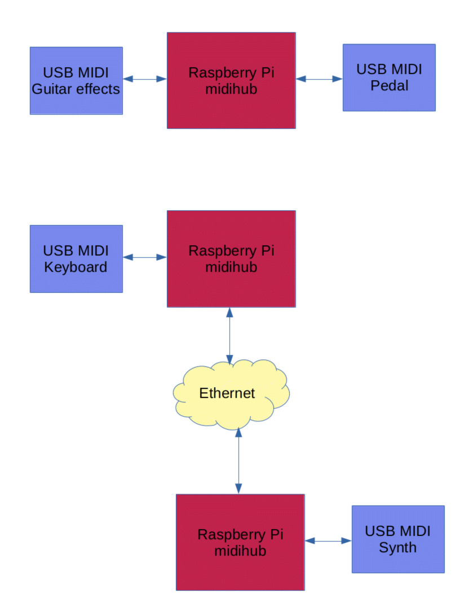

# Raspberry Pi USB Host MIDI hub



This project turns any Raspberry Pi into a USB host MIDI hub. The simplest case
is to plug two USB MIDI devices into the MIDI hub. The Pi hub automatically
routes MIDI IN to MIDI OUT of the two USB MIDI devices. No user intervention is
required. Once setup, the MIDI hub is as easy to use as an Ethernet hub/switch.
For example, plug in a guitar amp/effects box and a MIDI stompbox controller.
If DIN interfaces are needed, there are many USB MIDI to DIN cables.

Linux supports USB MIDI devices but user intervention is required to patch MIDI
IN to MIDI OUT. This project automatically detects and cross connects MIDI IN
to MIDI OUT for all MIDI devices it finds.

In addition, ipMIDI is supported for all USB MIDI devices so MIDI devices may
be connected to other computers or other MIDI hubs. To run ipMIDI on Mac or
Windows see
[https://www.nerds.de/en/ipmidi.html](https://www.nerds.de/en/ipmidi.html).

Two Raspberry Pi boards running the this project, communicate over Ethernet so
MIDI devices on both boards are connected. A simple case is to plug a MIDI
keyboard into midihub-A and a MIDI synth into midihub-B. Connect the midihubs
to a Ethernet hub or switch. multimidicast moves MIDI over UDP multicast over
Ethernet. Ethernet cables may be much longer than USB or MIDI cables so two
or more midi hubs may be used a MIDI over Ethernet extenders.

Do not using using WiFi because it adds delays and packet loss.

## Inspired by the following projects

https://github.com/schuyberg/rpi-midi-hub

https://m635j520.blogspot.com/2017/01/using-raspberry-pi-as-midi-usb5-pin.html

https://llg.cubic.org/tools/multimidicast/

## Installation

The easiest way to install is to download [midihub.run](https://github.com/gdsports/rpi-usb-host-midi-hub/raw/master/midihub.run)
to the Raspberry Pi then run it.

```
$ sudo sh midihub.run
```

This will extract and install all the required files. The other files are only
required if you want to change the default behavior or settings.
